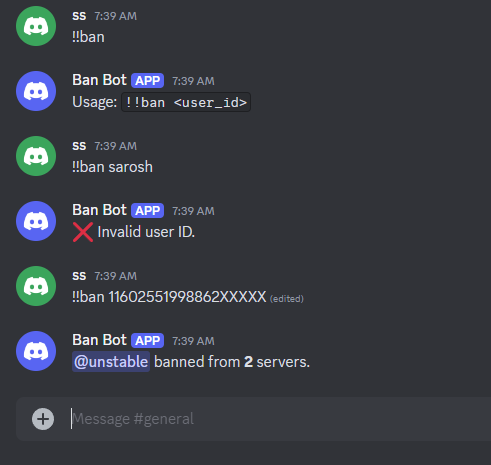

# Discord Cross Server Ban Bot 🔨

[](https://openjdk.org/)
[](https://github.com/DV8FromTheWorld/JDA)

A high-performance moderation bot that bans users across multiple Discord servers simultaneously. Built with Java and JDA library.

## 📸 Bot in Action

The screenshot below shows the bot successfully processing the `!!ban` command.
It validates the provided user ID and confirms the ban across multiple Discord servers
where the bot has sufficient permissions.



## ✨ Features
- **Cross-server banning** with `!!ban <user_id>`
- **Role hierarchy verification** (only admins/moderators can use)
- **Instant feedback** showing ban count across servers
- **Secure token management** via environment variables
- **Input validation** for user IDs and command syntax

## 🛠️ Tech Stack
- **Java 20.0.2** (LTS)
- **JDA 5.3.0** (Discord API wrapper)
- **Maven** (Dependency management)
- **Git** (Version control)

## 🚀 Quick Start

### Prerequisites
- JDK 20+ ([Download](https://openjdk.org/))
- Maven 3.9+ ([Install guide](https://maven.apache.org/install.html))
- Discord bot token ([Guide](https://discord.com/developers/docs/getting-started))

### Installation
1. Clone the repository:
   ```bash
   git clone https://github.com/yourusername/discord-mass-ban-bot.git
   cd discord-mass-ban-bot

2. Configure Environment:
   ```bash
   # Linux/macOS
   export DISCORD_TOKEN="your_bot_token_here"

   # Windows (PowerShell)
   $env:DISCORD_TOKEN="your_bot_token_here"

## 📜 Command Reference
| Command | Description | Example |
|---------|-------------|---------|
| `!!ban <user_id>` | Bans user from all servers where the bot has permissions | `!!ban 123456789012345678` |

💡 **Note**: 
- `<user_id>` must be a valid 18-19 digit Discord user ID
- Requires admin or higher role than the bot

## 🛡️ Security Note
Never commit your bot token! Always use:
- Environment variables (recommended)
- External configuration files (excluded via .gitignore)

